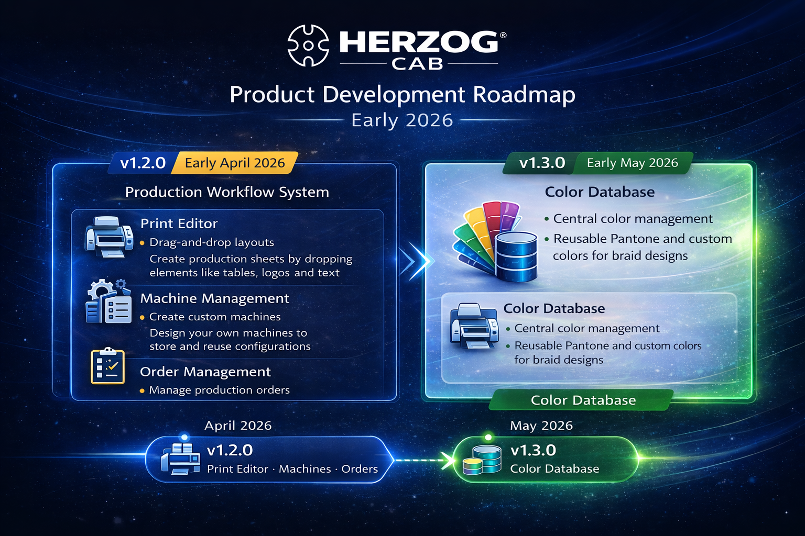

# Herzog CAB

Braiding design and calculation software for Herzog braiding machines.

---

## About

Herzog CAB is a software tool for designing and calculating braids used on Herzog braiding machines.

It allows users to:

- design round and flat braids
- perform braid calculations
- manage machines and production data
- generate production documentation

The project is actively developed and continuously improved.

---

# How to Contribute

Your feedback helps improve Herzog CAB.

### 🐞 Bug Reports

If you encounter a problem:

1. Go to **Issues**
2. Click **New Issue**
3. Select **Bug Report**

Include:

- software version
- screenshots
- steps to reproduce

---

### 💡 Feature Requests

Have an idea for improving Herzog CAB?

Create a **Feature Request** issue and describe the use case.

---

# Development Roadmap

The following roadmap outlines the upcoming development focus for Herzog CAB.

---

---

> **Roadmap Update – March 2026**  
> The originally planned release of **v1.2.0** (late February 2026) has been postponed to **early April 2026**.  
>  
> During development of the new **Print Editor**, additional functionality became necessary to properly support the production workflow.  
>  
> As a result, **machine configuration** and **order management** were added to the same release.

---

## Version 1.2.0 — Early April 2026

### Print Editor

- Drag-and-drop print layout editor
- Customizable tables, logos and text
- Flexible grid layout
- Editable print elements
- Generate machine setup sheets

### Machine Configuration

- Create custom braiding machines
- Store machine configurations
- Use machines in calculations

### Order Management

Production setups can now be organized using **orders**.

- Create production orders
- Assign machines
- Add materials and spools
- Perform calculations
- Generate braid designs
- Save production setups

---

## Version 1.3.0 — Early May 2026

### Color Database

Centralized color management.

- Central color database
- Pantone colors
- Custom colors
- Reusable color palettes

---

## Latest Version: 1.1.4

---

## Release Notes

Full changelog → **[CHANGELOG.md](CHANGELOG.md)**
